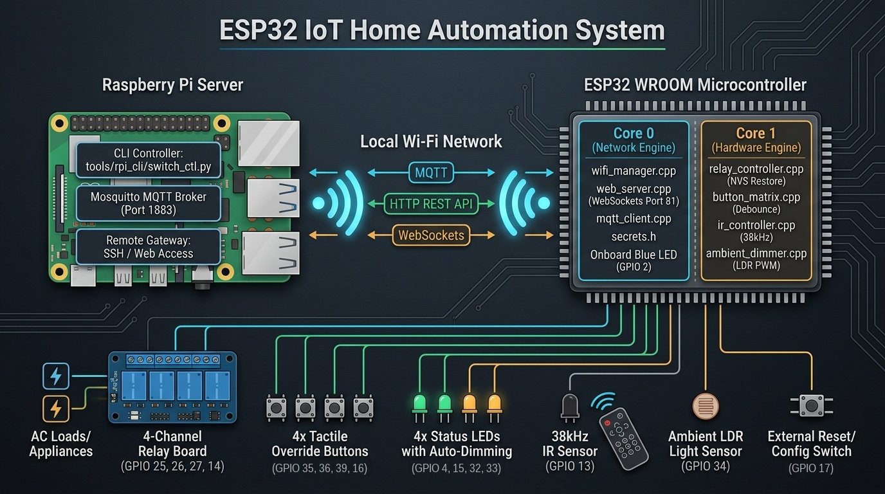

# Advanced IoT Home Automation System (ESP32)

An industrial-grade, edge-resilient smart controller for 4-channel appliance switching built on the **ESP32 WROOM**. Features hardware tactile overrides, optocoupled relay isolation, auto-dimming status LEDs via LDR, line-of-sight infrared remote control, an onboard WebSocket web dashboard, and bidirectional command-line and MQTT integration for Raspberry Pi.

---

## System Architecture



---

## Software Architecture: What Runs Where

The system is split across two computing nodes: your **Raspberry Pi Server** (for remote/central orchestration and CLI control) and the **ESP32 Microcontroller** (running dual-core FreeRTOS firmware for instant hardware control and local networking).

| Device / Computing Node | Core / Subsystem | Source Code / Module | Function & Responsibilities |
| :--- | :--- | :--- | :--- |
| **Raspberry Pi Server** | Terminal CLI | [`tools/rpi_cli/switch_ctl.py`](tools/rpi_cli/switch_ctl.py) | Command-line tool (`switch on 1`, `switch status`, etc.) via REST API or MQTT. |
| **Raspberry Pi Server** | System Service | [`tools/rpi_cli/install.sh`](tools/rpi_cli/install.sh) | Installs `switch` symlink globally into `/usr/local/bin/`. |
| **Raspberry Pi Server** | Message Broker | `mosquitto` (Port 1883) | Central MQTT message broker for local and remote smart home telemetry. |
| **Raspberry Pi Server** | Smart Home | `Home Assistant` (Optional) | Receives MQTT auto-discovery packets to auto-populate dashboard entities. |
| **Raspberry Pi Server** | Remote Gateway | `SSH / Tailscale / Tunnel` | Provides secure access from anywhere outside your local network. |
| **ESP32 Microcontroller** | FreeRTOS Scheduler | [`firmware/firmware.ino`](firmware/firmware.ino) | Initializes tasks, creates FreeRTOS queues, and coordinates cross-core events. |
| **ESP32 Microcontroller** | **Core 0 (Network Engine)** | [`firmware/wifi_manager.cpp`](firmware/wifi_manager.cpp) | Manages Wi-Fi STA connection, mDNS (`smartswitch.local`), fallback AP mode, and **Wi-Fi Status LED (GPIO 2)** via LEDC PWM. |
| **ESP32 Microcontroller** | **Core 0 (Network Engine)** | [`firmware/web_server.cpp`](firmware/web_server.cpp) | Serves REST API endpoints (`/api/status`, `/api/relay/{ch}/toggle`, `/api/reboot`). |
| **ESP32 Microcontroller** | **Core 0 (Network Engine)** | [`firmware/web_dashboard.h`](firmware/web_dashboard.h) | Self-contained, responsive dark-mode HTML5/CSS/JS dashboard stored in PROGMEM. |
| **ESP32 Microcontroller** | **Core 0 (Network Engine)** | [`firmware/web_server.cpp`](firmware/web_server.cpp) | WebSockets server on port 81 for zero-latency, bidirectional UI synchronization. |
| **ESP32 Microcontroller** | **Core 0 (Network Engine)** | [`firmware/mqtt_client.cpp`](firmware/mqtt_client.cpp) | Connects to Raspberry Pi MQTT broker, reports states, and handles incoming commands. |
| **ESP32 Microcontroller** | **Core 0 (Network Engine)** | [`firmware/secrets.h`](firmware/secrets.h) | Secure Wi-Fi credentials and Pi broker configuration (git-ignored). |
| **ESP32 Microcontroller** | **Core 1 (Hardware Engine)** | [`firmware/relay_controller.cpp`](firmware/relay_controller.cpp) | 4-channel active-low relay driver with **NVS flash state persistence** (restores states after power cut). |
| **ESP32 Microcontroller** | **Core 1 (Hardware Engine)** | [`firmware/button_matrix.cpp`](firmware/button_matrix.cpp) | Non-blocking tactile button debouncing (35ms) and reset button hold detection. |
| **ESP32 Microcontroller** | **Core 1 (Hardware Engine)** | [`firmware/ir_controller.cpp`](firmware/ir_controller.cpp) | 38kHz IR signal receiver (`IRremoteESP8266`) with default NEC codes and live learning. |
| **ESP32 Microcontroller** | **Core 1 (Hardware Engine)** | [`firmware/ambient_dimmer.cpp`](firmware/ambient_dimmer.cpp) | Reads ADC1 LDR with Exponential Moving Average (EMA) and drives 6-channel auto-dimmed LEDs (Relay 1-4, Power, Wi-Fi) via hardware LEDC PWM. |

---

## Hardware Pinout Matrix (100% GPIO Utilization — 25/25 Pins)

| Peripheral / Signal | ESP32 GPIO | Physical Pin | Mode / Type | Electrical / Functional Description |
| :--- | :--- | :--- | :--- | :--- |
| **Relay 1** | `GPIO 25` | Left Pin 8 | Digital Out | Optocoupled Relay Channel 1 (Active LOW trigger) |
| **Relay 2** | `GPIO 26` | Left Pin 9 | Digital Out | Optocoupled Relay Channel 2 (Active LOW trigger) |
| **Relay 3** | `GPIO 27` | Left Pin 10 | Digital Out | Optocoupled Relay Channel 3 (Active LOW trigger) |
| **Relay 4** | `GPIO 14` | Left Pin 11 | Digital Out | Optocoupled Relay Channel 4 (Active LOW trigger) |
| **Button 1 (Manual)** | `GPIO 35` | Left Pin 5 | Digital In (GPI) | Momentary to GND + **Mandatory external 10kΩ pull-up to 3.3V** |
| **Button 2 (Manual)** | `GPIO 36` (VP) | Left Pin 2 | Digital In (GPI) | Momentary to GND + **Mandatory external 10kΩ pull-up to 3.3V** |
| **Button 3 (Manual)** | `GPIO 39` (VN) | Left Pin 3 | Digital In (GPI) | Momentary to GND + **Mandatory external 10kΩ pull-up to 3.3V** |
| **Button 4 (Manual)** | `GPIO 16` (RX2) | Right Pin 10 | `INPUT_PULLUP` | Momentary push button to GND (Internal pull-up enabled) |
| **Config / Reset** | `GPIO 17` (TX2) | Right Pin 9 | `INPUT_PULLUP` | Momentary to GND (Short = Reboot; Hold 5s = AP Mode) |
| **Status LED 1** | `GPIO 4` | Right Pin 11 | LEDC PWM (Ch 0) | 220Ω resistor; mirrors Relay 1 (PWM auto-dimmed via LDR) |
| **Status LED 2** | `GPIO 15` | Right Pin 13 | LEDC PWM (Ch 1) | 220Ω resistor; mirrors Relay 2 (*MTDO strapping safe*, auto-dimmed) |
| **Status LED 3** | `GPIO 32` | Left Pin 6 | LEDC PWM (Ch 2) | 220Ω resistor; mirrors Relay 3 (PWM auto-dimmed via LDR) |
| **Status LED 4** | `GPIO 33` | Left Pin 7 | LEDC PWM (Ch 3) | 220Ω resistor; mirrors Relay 4 (PWM auto-dimmed via LDR) |
| **Power Indicator LED** | `GPIO 12` | Left Pin 12 | LEDC PWM (Ch 4) | 330Ω to GND; Always ON (*MTDI 3.3V flash boot-safe*, auto-dimmed) |
| **Wi-Fi Status LED** | `GPIO 2` | Right Pin 12 | LEDC PWM (Ch 5) | On-board Blue LED (Solid connected / Breathing AP / Auto-dimmed) |
| **TSOP 38kHz IR RX** | `GPIO 13` | Left Pin 13 | Digital In / INT | 38kHz IR demodulator (TSOP38238 / 15120P) + Active LED indicator |
| **Ambient LDR Sensor** | `GPIO 34` | Left Pin 4 | ADC1_CH6 | 10kΩ voltage divider (ADC1 operates concurrently with Wi-Fi) |
| **[RESERVED] I2C SDA** | `GPIO 21` | Right Pin 5 | Hardware I2C | Native Wire Data line for OLED displays, RTC, sensors |
| **[RESERVED] I2C SCL** | `GPIO 22` | Right Pin 2 | Hardware I2C | Native Wire Clock line |
| **[RESERVED] SPI MOSI** | `GPIO 23` | Right Pin 1 | Hardware VSPI | Native Master-Out Slave-In line for SD cards / TFTs |
| **[RESERVED] SPI MISO** | `GPIO 19` | Right Pin 6 | Hardware VSPI | Native Master-In Slave-Out line |
| **[RESERVED] SPI SCK** | `GPIO 18` | Right Pin 7 | Hardware VSPI | Native High-Speed Clock line |
| **[RESERVED] SPI CS** | `GPIO 5` | Right Pin 8 | Hardware VSPI | Native Chip Select line (Internal pull-up at boot) |
| **[RESERVED] UART TX** | `GPIO 1` (TX0) | Right Pin 3 | Hardware UART0 | Native Serial Monitor / CP2102 USB Bridge |
| **[RESERVED] UART RX** | `GPIO 3` (RX0) | Right Pin 4 | Hardware UART0 | Native Serial Monitor / CP2102 USB Bridge |

Detailed schematics and isolation rules: [`docs/PINOUT_AND_SCHEMATICS.md`](docs/PINOUT_AND_SCHEMATICS.md).

---

## Wi-Fi & Credentials Setup

The project follows a secure, decoupled secrets architecture:

### 1. Credentials File (`secrets.h`)
Network credentials are kept in a dedicated header file:
* **Template:** [`firmware/secrets.h.example`](firmware/secrets.h.example)
* **Active File:** `firmware/secrets.h` (listed in [`.gitignore`](.gitignore) to prevent committing credentials)

```c
#pragma once

// ── WiFi Credentials ──────────────────────────────────────────────────────────
#define WIFI_SSID       "YOUR_WIFI_SSID"
#define WIFI_PASSWORD   "YOUR_WIFI_PASSWORD"

// ── Raspberry Pi MQTT Broker ──────────────────────────────────────────────────
#define MQTT_BROKER_IP  "192.168.1.250"   // IP of your Raspberry Pi
#define MQTT_PORT       1883
#define MQTT_USER       ""                // Leave blank if broker has no auth
#define MQTT_PASS       ""
```

If `secrets.h` is missing, [`firmware/config.h`](firmware/config.h) automatically falls back to placeholder constants with a compiler warning.

### 2. Wi-Fi Status LED Indicator (`GPIO 2`)
* **Solid Blue LED:** Connected to Wi-Fi network and operational.
* **Pulsing / Breathing LED:** SoftAP configuration mode (`SmartSwitch-Setup`).
* **Blinking LED:** Attempting Wi-Fi connection / reconnecting.
* **Auto-Dimmed:** Peak brightness dynamically scales with ambient room light (LEDC Ch 5).

### 3. Fallback SoftAP Mode
If the configured Wi-Fi network is unavailable or credentials need to be changed without reflashing:
1. Hold the Config button (`GPIO 17 / TX2`) for **5 seconds**.
2. Connect to the Wi-Fi hotspot:
   * **SSID:** `SmartSwitch-Setup`
   * **Password:** `12345678`
3. Open `http://192.168.4.1` to enter new credentials.

---

## Quick Start

### 1. Compile Firmware
Use the included compilation script (`arduino-cli`):
```bash
./build.sh
```

### 2. Upload to ESP32
Connect your ESP32 board via USB and run:
```bash
./upload.sh /dev/ttyUSB0
```

---

## Embedded Web Dashboard

Once connected to your local network, open any browser on your phone, tablet, or PC:
```
http://smartswitch.local
```
*(Or navigate to the device IP, e.g. `http://192.168.1.20`)*

* **Real-time WebSockets:** Instant UI sync when physical buttons or IR remote buttons are pressed.
* **Sensor readouts:** Live LDR light levels, status LED PWM brightness, and uptime.
* **IR Code Monitor:** Shows hex codes of any remote control pointed at the sensor.

---

## Raspberry Pi CLI Controller (`switch`)

To control the switch from your Raspberry Pi terminal:

```bash
cd tools/rpi_cli
sudo ./install.sh
```

### Usage Examples:
```bash
switch status         # Prints formatted status table of all relays & sensors
switch on 1           # Turns Appliance 1 ON
switch off 2          # Turns Appliance 2 OFF
switch toggle 3       # Toggles Appliance 3
switch on all         # Turns all appliances ON
switch off all        # Turns all appliances OFF
switch status --json  # Machine-readable output for scripts / cron
```

### Remote Access:
Because your Raspberry Pi is accessible from anywhere (via SSH, Tailscale, or Cloudflare Tunnel), you can control your appliances remotely:
```bash
ssh user@your-pi-ip "switch on 1"
```

Full API and MQTT topic documentation: [`docs/API_AND_MQTT.md`](docs/API_AND_MQTT.md).
