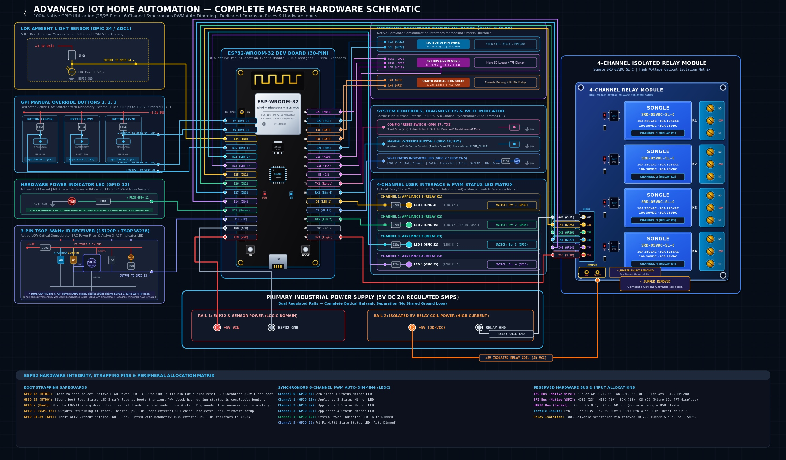
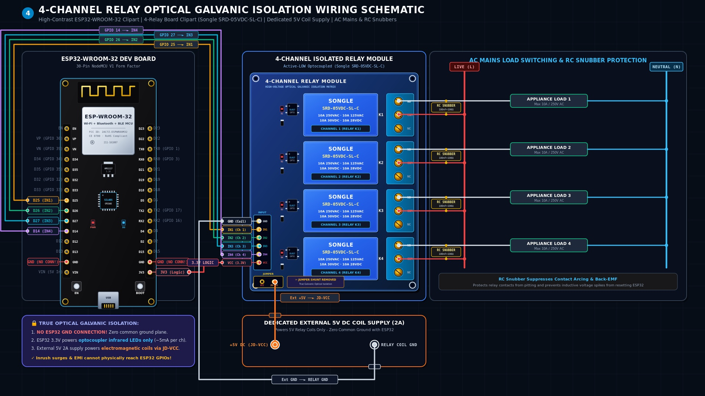
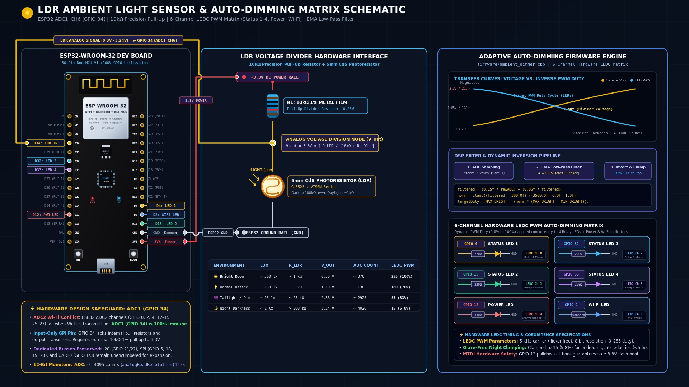
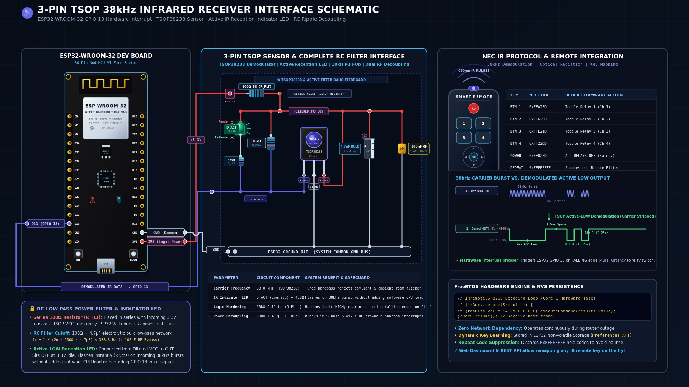

# Hardware Specifications, Requirements & Schematics

## 1. System Requirements & Functional Specifications

### 1.1 Core Objectives
The **Advanced IoT Home Automation System** is an industrial-grade, edge-resilient smart controller designed for 4-channel appliance switching. The system maintains continuous, full offline operation through physical inputs and local line-of-sight wireless control, while offering high-speed network connectivity and remote management via a Raspberry Pi server.

### 1.2 Functional Requirements
| Subsystem | Requirement | Implementation Detail |
| :--- | :--- | :--- |
| **Power Switching** | Independent switching of 4 high-voltage AC loads (up to 250V AC / 10A per channel). | Optocoupled 4-channel relay matrix with isolated ground & flyback protection. |
| **Edge Autonomy** | Zero-latency local switching without reliance on Wi-Fi, routers, or servers. | Dedicated hardware interrupt / tight polling loop running on ESP32 Core 1. |
| **Physical Feedback** | Visual confirmation of active circuits and system state. | 4 status LEDs mapped 1:1 to relay channels, auto-dimmed via hardware PWM. |
| **Ambient Adaptation** | Non-intrusive nighttime illumination. | LDR sensor on ADC1 measuring ambient lux and adjusting LED brightness via EMA filter. |
| **Wireless Input** | Secondary local wireless line-of-sight control (up to 15m range). | 3-Pin TSOP 38kHz IR Receiver (15120P / TSOP38238) decoding NEC/RC5 protocols. |
| **Power-Cut Recovery** | Restore previous operational states after grid power failure. | Persistent state storage in ESP32 Non-Volatile Storage (NVS / Preferences API). |
| **System Diagnostics** | Hard reboot and network reconfiguration. | Dedicated external button (short press = reboot; hold 5s = Wi-Fi config AP mode). |
| **Network Interfaces** | Local browser UI, REST API, MQTT telemetry, and Raspberry Pi CLI. | Dual-core FreeRTOS task on Core 0 running HTTP server, WebSockets, and MQTT client. |

---

## 2. ESP32 Master Pin Allocation Table (30-Pin NodeMCU V1)

> **Hardware Design & Stability Safeguards (100% GPIO Utilization — 25/25 Pins):**
> - **Zero Pin Conflicts:** All 25 accessible GPIO pins on the 30-pin board are strategically assigned with zero wasted pins and zero port expanders.
> - **Boot-Strapping Safety (`GPIO 12, 15, 2, 5`):**
>   - `GPIO 12 (MTDI)`: Flash voltage select. Connected to **Power LED** (Active-HIGH: Anode to GP12, Cathode through 330Ω to GND). Acts as a hardware pull-down at boot, **guaranteeing 3.3V flash boot**.
>   - `GPIO 15 (MTDO)`: Connected to **Status LED 2**; brief power-on boot PWM clock is benign to an LED and never toggles relays.
>   - `GPIO 2`: Connected to **Wi-Fi Status LED** (leverages on-board blue LED pulled to GND).
>   - `GPIO 5`: Connected to **Reserved SPI CS** (internal pull-up at boot keeps SPI devices deselected).
> - **Input-Only Pins (`GPIO 34, 35, 36, 39`):** Lack internal pull-ups/pull-downs. Used for LDR (`GPIO 34` on ADC1) and manual buttons 1–3 (`GPIO 35, 36, 39`) with **mandatory external $10\text{k}\Omega$ pull-up resistors** to 3.3V.
> - **Relay Immunity:** All 4 relays sit on dedicated, glitch-free GPIOs (`GPIO 25, 26, 27, 14`).
> - **6-Channel Auto-Dimming (LEDC):** Status LEDs 1–4, Power LED, and Wi-Fi Status LED are driven by hardware LEDC PWM channels (0–5), auto-dimmed synchronously via the LDR sensor.
> - **Dedicated Communication Busses:** Full native hardware I2C (`GPIO 21/22`), SPI (`GPIO 18/19/23/5`), and UART0 (`GPIO 1/3`) are reserved for external peripherals.

```
                      +-------------------+
             EN (RST) | [ ]           [ ] | D23 (VSPI MOSI) [RESERVED]
    Button 2 (GPIO36) | [ ]           [ ] | D22 (I2C SCL)   [RESERVED]
    Button 3 (GPIO39) | [ ]           [ ] | TX0 (UART0 TX)  [RESERVED]
      LDR In (GPIO34) | [ ]           [ ] | RX0 (UART0 RX)  [RESERVED]
    Button 1 (GPIO35) | [ ]   ESP32   [ ] | D21 (I2C SDA)   [RESERVED]
  Status LED 3 (GP32) | [ ]  WROOM-32 [ ] | D19 (VSPI MISO) [RESERVED]
  Status LED 4 (GP33) | [ ]   30-PIN  [ ] | D18 (VSPI SCK)  [RESERVED]
     Relay 1 (GPIO25) | [ ]           [ ] | D5  (VSPI CS)   [RESERVED]
     Relay 2 (GPIO26) | [ ]           [ ] | TX2 (Reset / Config AP Button - GP17)
     Relay 3 (GPIO27) | [ ]           [ ] | RX2 (Button 4 - GP16)
     Relay 4 (GPIO14) | [ ]           [ ] | D4  (Status LED 1 - GP4)
   Power LED (GPIO12) | [ ]           [ ] | D2  (Wi-Fi Status LED - GP2)
  TSOP IR RX (GPIO13) | [ ]           [ ] | D15 (Status LED 2 - GP15)
                  GND | [ ]           [ ] | GND
                  VIN | [ ]           [ ] | 3V3
                      +-------------------+
```

| Pin | Physical Header | Direction | Component Function | Peripheral Mode | Hardware Electrical Notes |
| :--- | :--- | :--- | :--- | :--- | :--- |
| **GPIO 25** | Left Pin 8  | Output | **Relay 1 Control** | Digital Out | Active LOW trigger to optocoupler input |
| **GPIO 26** | Left Pin 9  | Output | **Relay 2 Control** | Digital Out | Active LOW trigger to optocoupler input |
| **GPIO 27** | Left Pin 10 | Output | **Relay 3 Control** | Digital Out | Active LOW trigger to optocoupler input |
| **GPIO 14** | Left Pin 11 | Output | **Relay 4 Control** | Digital Out | Active LOW trigger to optocoupler input |
| **GPIO 4**  | Right Pin 11| Output | **Status LED 1** | LEDC PWM (Ch 0) | $220\Omega$ resistor; mirrors Relay 1 (PWM auto-dimmed) |
| **GPIO 15** | Right Pin 13| Output | **Status LED 2** | LEDC PWM (Ch 1) | $220\Omega$ resistor; mirrors Relay 2 (*MTDO strapping safe*) |
| **GPIO 32** | Left Pin 6  | Output | **Status LED 3** | LEDC PWM (Ch 2) | $220\Omega$ resistor; mirrors Relay 3 (PWM auto-dimmed) |
| **GPIO 33** | Left Pin 7  | Output | **Status LED 4** | LEDC PWM (Ch 3) | $220\Omega$ resistor; mirrors Relay 4 (PWM auto-dimmed) |
| **GPIO 12** | Left Pin 12 | Output | **Power Indicator LED** | LEDC PWM (Ch 4) | $330\Omega$ resistor to GND; **PWM auto-dimmed** (*MTDI safe pull-down*) |
| **GPIO 2**  | Right Pin 12| Output | **Wi-Fi Status LED** | LEDC PWM (Ch 5) | On-board Blue LED (or external); **PWM auto-dimmed** |
| **GPIO 13** | Left Pin 13 | Input  | **TSOP 38kHz IR RX** | Digital In / INT | Demodulated Active-LOW pulse stream from TSOP38238 |
| **GPIO 34** | Left Pin 4  | Input  | **LDR Ambient Sensor**| ADC1_CH6 | Analog voltage divider (ADC1 operates concurrently with Wi-Fi) |
| **GPIO 35** | Left Pin 5  | Input  | **Button 1 (Manual)** | Digital In (GPI) | Momentary to GND + **External $10\text{k}\Omega$ pull-up to 3.3V** |
| **GPIO 36** | Left Pin 2 (VP)| Input | **Button 2 (Manual)** | Digital In (GPI) | Momentary to GND + **External $10\text{k}\Omega$ pull-up to 3.3V** |
| **GPIO 39** | Left Pin 3 (VN)| Input | **Button 3 (Manual)** | Digital In (GPI) | Momentary to GND + **External $10\text{k}\Omega$ pull-up to 3.3V** |
| **GPIO 16** | Right Pin 10| Input  | **Button 4 (Manual)** | `INPUT_PULLUP` | Momentary push button to GND (Internal pull-up enabled) |
| **GPIO 17** | Right Pin 9 | Input  | **Reset / Config AP** | `INPUT_PULLUP` | Momentary to GND (Short = Reboot; 5s hold = AP Mode) |
| **GPIO 21** | Right Pin 5 | Bidirectional | **[RESERVED] I2C SDA**| Hardware I2C | Native Wire Data line (OLED, RTC, BME280) |
| **GPIO 22** | Right Pin 2 | Output | **[RESERVED] I2C SCL**| Hardware I2C | Native Wire Clock line |
| **GPIO 18** | Right Pin 7 | Output | **[RESERVED] SPI SCK** | Hardware VSPI | Native High-Speed Clock line |
| **GPIO 19** | Right Pin 6 | Input  | **[RESERVED] SPI MISO**| Hardware VSPI | Native Master-In Slave-Out line |
| **GPIO 23** | Right Pin 1 | Output | **[RESERVED] SPI MOSI**| Hardware VSPI | Native Master-Out Slave-In line |
| **GPIO 5**  | Right Pin 8 | Output | **[RESERVED] SPI CS**  | Hardware VSPI | Native Chip Select line (Internal pull-up at boot) |
| **GPIO 1**  | Right Pin 3 (TX0)| Output | **[RESERVED] UART TX**| Hardware UART0 | Native Serial Monitor / CP2102 USB Bridge |
| **GPIO 3**  | Right Pin 4 (RX0)| Input  | **[RESERVED] UART RX**| Hardware UART0 | Native Serial Monitor / CP2102 USB Bridge |

---

## 3. Electrical Schematics & Interface Circuits

### Complete System Wiring Diagram


---

### 3.1 4-Channel Relay Isolation Circuit
To protect the ESP32 from high-voltage spikes and electromagnetic interference (EMI):

```
ESP32 (3.3V Logic)               Optocoupled Relay Module (5V Isolated)
┌─────────────────┐             ┌─────────────────────────────────────┐
│                 │             │                                     │
│         VCC 3.3V├─────────────┤ VCC (Optocoupler Anodes)            │
│                 │             │                                     │
│   GPIO 25 (Ch1) ├─────────────┤ IN1 (Cathode through internal LED) │
│   GPIO 26 (Ch2) ├─────────────┤ IN2                                 │
│   GPIO 27 (Ch3) ├─────────────┤ IN3                                 │
│   GPIO 14 (Ch4) ├─────────────┤ IN4                                 │
│                 │             │                                     │
│                 │             │ [REMOVE JD-VCC JUMPER]              │
│                 │             │ JD-VCC ◄─── External 5V DC Supply   │
│                 │             │ GND    ◄─── External 5V DC GND      │
└─────────────────┘             └─────────────────────────────────────┘
```

> **Complete Galvanic Isolation:**
> Remove the blue `VCC-JDVCC` jumper on the relay board! Connect `VCC` to ESP32 3.3V, and connect `JD-VCC` and `GND` directly to your dedicated 5V power supply. This ensures relay coil switching noise does not enter the ESP32 ground plane.

#### Dedicated Relay Isolation & Power Hookup:


---

### 3.2 Inductive Load Snubber Network
When driving inductive loads (fans, fluorescent ballasts, refrigerator compressors), the collapsing magnetic field produces a high-voltage spark across relay contacts.
* Install an **RC Snubber** across each relay's `NO` and `COM` terminals:
  * **Capacitor:** `100nF (0.1µF) 275V AC X2 safety-rated metallized film`
  * **Resistor:** `100Ω 1W or 2W flame-proof metal oxide`

---

### 3.3 LDR Ambient Light Voltage Divider
```
        +3.3V (ESP32)
          │
          │
         ┌┴┐
         │ │  10kΩ 1% Resistor
         │ │
         └┬┘
          ├───► To GPIO 34 (ADC1_CH6)
          │
         ┌┴┐
         │/│  LDR (Light Dependent Resistor, 5mm / 10k-20kΩ light resistance)
         └┬┘
          │
         GND
```
* **Behavior:**
  * **Bright room:** LDR resistance drops (~1kΩ) -> Voltage at GPIO 34 approaches 0V (ADC low).
  * **Dark room:** LDR resistance rises (>500kΩ) -> Voltage at GPIO 34 approaches 3.3V (ADC high).
  * *Firmware logic calculates Lux inversely and lowers LED PWM duty cycle at night.*

#### Dedicated LDR Ambient Light Sensor & Voltage Divider Schematic:


---

### 3.4 3-Pin TSOP 38kHz IR Receiver (15120P / TSOP38238) Interface Module
```
          +3.3V (ESP32)
            │
           ┌┴┐ 100Ω Decoupling Resistor (R_FLT)
           └┬┘
            ├───► Filtered VCC (3.3V)
            │       │                        │
            │       ├─► VCC (Pin 3 TSOP)     ├─► [ 10kΩ R_PULL ] ──┐
            │       │                        │                     │
           ───      │                        └─►| (D_ACT LED)      │
           ─── 4.7µF Bulk Cap (C_FLT)          │                   │
            │  || 100nF Ceramic (C_BYP)       [ 470Ω R_LED ]       │
            │       │                                │             │
           GND ─────┴─► GND (Pin 2 TSOP)             ▼             ▼
                                                     │             │
 ESP32 GPIO 13 ◄─────────────────────── OUT (Pin 1) ─┴─────────────┘
```
* **Active-LOW Reception Indicator LED ($D_{\text{ACT}}$):** Connected between Filtered VCC and OUT via a $470\Omega$ resistor ($R_{\text{LED}}$). Sits OFF during idle (both sides at 3.3V); flashes instantly (<5ms) on incoming 38kHz bursts when TSOP sinks Pin 1 to 0V.
* **10kΩ Pull-Up ($R_{\text{PULL}}$):** Hardens the logic HIGH state against line capacitance and Wi-Fi RF crosstalk.
* **Dual Decoupling Filter ($100\Omega + 4.7\mu\text{F} + 100\text{nF}$):** Blocks SMPS switching ripple and Wi-Fi RF brownout chatter ($f_c \approx 338.6\text{ Hz}$), eliminating phantom interrupts on GPIO 13.

#### Dedicated 3-Pin TSOP 38kHz IR Receiver & Active Filter Schematic:


---

### 3.5 6-Channel Status & Diagnostic LEDs (LEDC PWM Auto-Dimmed)
```
 Appliance Status LEDs (Channels 1–4):
  ESP32 GPIO 4  (LEDC Ch 0) ───[ 220Ω ]───►| (Green LED 1) ───► GND
  ESP32 GPIO 15 (LEDC Ch 1) ───[ 220Ω ]───►| (Green LED 2) ───► GND  [*MTDO Strapping Safe*]
  ESP32 GPIO 32 (LEDC Ch 2) ───[ 220Ω ]───►| (Green LED 3) ───► GND
  ESP32 GPIO 33 (LEDC Ch 3) ───[ 220Ω ]───►| (Green LED 4) ───► GND

 System Diagnostic & Indicator LEDs:
  ESP32 GPIO 12 (LEDC Ch 4) ───[ 330Ω ]───►| (Red PWR LED)  ───► GND  [*MTDI 3.3V Boot Pull-Down*]
  ESP32 GPIO 2  (LEDC Ch 5) ───[ 220Ω ]───►| (Blue Wi-Fi)   ───► GND  [*On-board or External*]
```
* **Synchronous Auto-Dimming:** All 6 LEDs are driven by hardware LEDC PWM timers (12-bit / 5kHz), dynamically adjusting duty cycles from day mode (100%) to soft night mode (~6%) based on the LDR sensor.
* **Boot Strapping Protection:** GPIO 12 is pulled low at startup via the Power LED resistor ($330\Omega$ to GND), guaranteeing the ESP32 powers on with correct 3.3V flash LDO voltage.

---

### 3.6 Tactile Override Buttons & System Diagnostics
```
 GPI Manual Override Push Buttons (GPI-only pins without internal pull-ups):
            +3.3V (ESP32)
              │
             ┌┴┐ 10kΩ External Pull-Up Resistor
             └┬┘
              ├───► ESP32 GPIO (35, 36, 39)
              │
              ○  Tactile Momentary Push Button
               \
              ○
              │
             GND

 Standard GPIO Push Buttons (Leveraging internal pull-ups):
  ESP32 GPIO 16 (Button 4)  ───○ \ ○───► GND (Configured with pinMode(16, INPUT_PULLUP))
  ESP32 GPIO 17 (Reset/AP)  ───○ \ ○───► GND (Configured with pinMode(17, INPUT_PULLUP))
```
* **GPI Pin Architecture:** GPIO 35, 36 (VP), and 39 (VN) are dedicated input-only pins lacking internal pull-up / pull-down silicon resistors. External $10\text{k}\Omega$ resistors pull these lines stiffly to $+3.3\text{V}$, preventing float.
* **Config / Reset Operation:** Short press (<1s) reboots the ESP32 MCU cleanly. Holding down for $\ge 5\text{s}$ triggers SoftAP Wi-Fi provisioning mode.

---

## 4. Power Architecture

* **Primary Supply:** 5V 2A regulated power supply (e.g., Hi-Link HLK-PM01 AC-DC module or 5V 2A industrial SMPS).
* The 5V rail powers:
  * Relay coils (`JD-VCC`).
  * ESP32 Board `5V / VIN` pin (fed into on-board AMS1117-3.3V regulator).
* High-voltage AC mains wiring (Live & Neutral) must maintain a minimum of **5mm creepage distance** from the low-voltage DC traces on the PCB.
