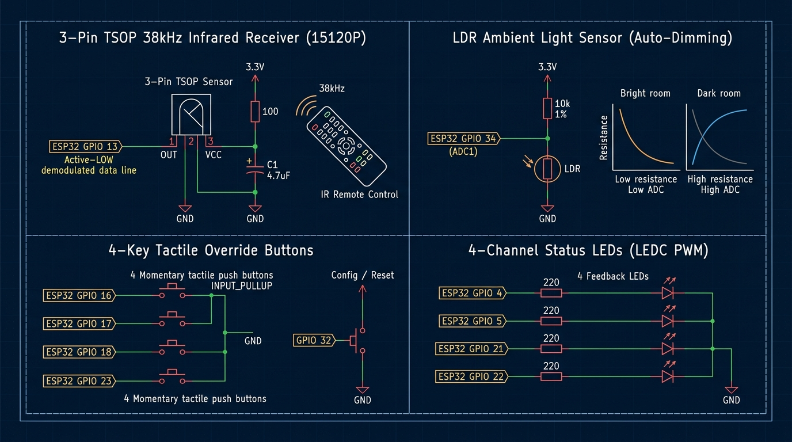

# Hardware Specifications, Requirements & Schematics

## 1. System Requirements & Functional Specifications

### 1.1 Core Objectives
The **Advanced IoT Home Automation System** is an industrial-grade, edge-resilient smart controller designed for 4-channel appliance switching. The system maintains continuous, full offline operation through physical inputs and local line-of-sight wireless control, while offering high-speed network connectivity and remote management via a Raspberry Pi server.

### 1.2 Functional Requirements
| Subsystem | Requirement | Implementation Detail |
| :--- | :--- | :--- |
| **Power Switching** | Independent switching of 4 high-voltage AC loads (up to 250V AC / 10A per channel). | Optocoupled 4-channel relay matrix with isolated ground & flyback protection. |
| **Edge Autonomy** | Zero-latency local switching without reliance on Wi-Fi, routers, or servers. | Dedicated hardware interrupt / tight polling loop running on ESP32 Core 1. |
| **Physical Feedback** | Visual confirmation of active circuits and system state. | 4 status LEDs mapped 1:1 to relay channels, auto-dimmed via hardware PWM. |
| **Ambient Adaptation** | Non-intrusive nighttime illumination. | LDR sensor on ADC1 measuring ambient lux and adjusting LED brightness via EMA filter. |
| **Wireless Input** | Secondary local wireless line-of-sight control (up to 15m range). | 3-Pin TSOP 38kHz IR Receiver (15120P / TSOP38238) decoding NEC/RC5 protocols. |
| **Power-Cut Recovery** | Restore previous operational states after grid power failure. | Persistent state storage in ESP32 Non-Volatile Storage (NVS / Preferences API). |
| **System Diagnostics** | Hard reboot and network reconfiguration. | Dedicated external button (short press = reboot; hold 5s = Wi-Fi config AP mode). |
| **Network Interfaces** | Local browser UI, REST API, MQTT telemetry, and Raspberry Pi CLI. | Dual-core FreeRTOS task on Core 0 running HTTP server, WebSockets, and MQTT client. |

---

## 2. ESP32 Master Pin Allocation Table

> **Pin Selection Safeguards:**
> - Avoids boot-strapping pins (`GPIO 0, 2, 12, 15`) that cause boot failure or relay chatter.
> - LDR is positioned on **ADC1 (GPIO 34)** because ESP32's ADC2 is disabled when Wi-Fi is transmitting.
> - Status LEDs utilize hardware **LEDC PWM channels (0–3)** for flicker-free dimming.

| Pin | Physical Header | Direction | Component Function | Peripheral Mode | Hardware Electrical Notes |
| :--- | :--- | :--- | :--- | :--- | :--- |
| **GPIO 25** | Left Pin 8  | Output | **Relay 1 Control** | Digital Out | Active LOW trigger to optocoupler input |
| **GPIO 26** | Left Pin 9  | Output | **Relay 2 Control** | Digital Out | Active LOW trigger to optocoupler input |
| **GPIO 27** | Left Pin 10 | Output | **Relay 3 Control** | Digital Out | Active LOW trigger to optocoupler input |
| **GPIO 14** | Left Pin 11 | Output | **Relay 4 Control** | Digital Out | Active LOW trigger to optocoupler input |
| **GPIO 16** | Right Pin 10| Input  | **Button 1 (Tactile)** | `INPUT_PULLUP` | Momentary push button to GND (25ms debounce) |
| **GPIO 17** | Right Pin 9 | Input  | **Button 2 (Tactile)** | `INPUT_PULLUP` | Momentary push button to GND (25ms debounce) |
| **GPIO 18** | Right Pin 7 | Input  | **Button 3 (Tactile)** | `INPUT_PULLUP` | Momentary push button to GND (25ms debounce) |
| **GPIO 23** | Right Pin 1 | Input  | **Button 4 (Tactile)** | `INPUT_PULLUP` | Momentary push button to GND (25ms debounce) |
| **GPIO 4**  | Right Pin 11| Output | **Status LED 1** | LEDC PWM (Ch 0) | Driven via 220Ω resistor; mirrors Relay 1 |
| **GPIO 5**  | Right Pin 8 | Output | **Status LED 2** | LEDC PWM (Ch 1) | Driven via 220Ω resistor; mirrors Relay 2 |
| **GPIO 21** | Right Pin 5 | Output | **Status LED 3** | LEDC PWM (Ch 2) | Driven via 220Ω resistor; mirrors Relay 3 |
| **GPIO 22** | Right Pin 2 | Output | **Status LED 4** | LEDC PWM (Ch 3) | Driven via 220Ω resistor; mirrors Relay 4 |
| **GPIO 13** | Left Pin 13 | Input  | **TSOP 38kHz IR Receiver (Data)** | Digital In / INT | Demodulated pulse stream from 3-Pin TSOP |
| **GPIO 34** | Left Pin 4  | Input  | **LDR Ambient Sensor** | ADC1_CH6 | Analog voltage divider (10kΩ pull-up to 3.3V) |
| **GPIO 32** | Left Pin 6  | Input  | **External Reset / Config**| `INPUT_PULLUP` | Momentary button to GND (Short = Reboot; 5s hold = AP Mode) |
| **GPIO 2**  | Right Pin 12| Output | **On-Board Blue LED** | Digital Out | Solid ON when Wi-Fi connected; OFF when disconnected/AP |

---

## 3. Electrical Schematics & Interface Circuits

### Complete System Wiring Diagram


---

### 3.1 4-Channel Relay Isolation Circuit
To protect the ESP32 from high-voltage spikes and electromagnetic interference (EMI):

```
ESP32 (3.3V Logic)               Optocoupled Relay Module (5V Isolated)
┌─────────────────┐             ┌─────────────────────────────────────┐
│                 │             │                                     │
│         VCC 3.3V├─────────────┤ VCC (Optocoupler Anodes)            │
│                 │             │                                     │
│   GPIO 25 (Ch1) ├─────────────┤ IN1 (Cathode through internal LED) │
│   GPIO 26 (Ch2) ├─────────────┤ IN2                                 │
│   GPIO 27 (Ch3) ├─────────────┤ IN3                                 │
│   GPIO 14 (Ch4) ├─────────────┤ IN4                                 │
│                 │             │                                     │
│                 │             │ [REMOVE JD-VCC JUMPER]              │
│                 │             │ JD-VCC ◄─── External 5V DC Supply   │
│                 │             │ GND    ◄─── External 5V DC GND      │
└─────────────────┘             └─────────────────────────────────────┘
```

> **Complete Galvanic Isolation:**
> Remove the blue `VCC-JDVCC` jumper on the relay board! Connect `VCC` to ESP32 3.3V, and connect `JD-VCC` and `GND` directly to your dedicated 5V power supply. This ensures relay coil switching noise does not enter the ESP32 ground plane.

#### Dedicated Relay Isolation & Power Hookup:


---

### 3.2 Inductive Load Snubber Network
When driving inductive loads (fans, fluorescent ballasts, refrigerator compressors), the collapsing magnetic field produces a high-voltage spark across relay contacts.
* Install an **RC Snubber** across each relay's `NO` and `COM` terminals:
  * **Capacitor:** `100nF (0.1µF) 275V AC X2 safety-rated metallized film`
  * **Resistor:** `100Ω 1W or 2W flame-proof metal oxide`

---

### 3.3 LDR Ambient Light Voltage Divider
```
        +3.3V (ESP32)
          │
          │
         ┌┴┐
         │ │  10kΩ 1% Resistor
         │ │
         └┬┘
          ├───► To GPIO 34 (ADC1_CH6)
          │
         ┌┴┐
         │/│  LDR (Light Dependent Resistor, 5mm / 10k-20kΩ light resistance)
         └┬┘
          │
         GND
```
* **Behavior:**
  * **Bright room:** LDR resistance drops (~1kΩ) -> Voltage at GPIO 34 approaches 0V (ADC low).
  * **Dark room:** LDR resistance rises (>500kΩ) -> Voltage at GPIO 34 approaches 3.3V (ADC high).
  * *Firmware logic calculates Lux inversely and lowers LED PWM duty cycle at night.*

#### Dedicated LDR Ambient Light Sensor & Voltage Divider Schematic:


---

### 3.4 3-Pin TSOP 38kHz IR Receiver (15120P / TSOP38238) Interface Module
```
          +3.3V (ESP32)
            │
           ┌┴┐ 100Ω Decoupling Resistor (R_FLT)
           └┬┘
            ├───► Filtered VCC (3.3V)
            │       │                        │
            │       ├─► VCC (Pin 3 TSOP)     ├─► [ 10kΩ R_PULL ] ──┐
            │       │                        │                     │
           ───      │                        └─►| (D_ACT LED)      │
           ─── 4.7µF Bulk Cap (C_FLT)          │                   │
            │  || 100nF Ceramic (C_BYP)       [ 470Ω R_LED ]       │
            │       │                                │             │
           GND ─────┴─► GND (Pin 2 TSOP)             ▼             ▼
                                                     │             │
 ESP32 GPIO 13 ◄─────────────────────── OUT (Pin 1) ─┴─────────────┘
```
* **Active-LOW Reception Indicator LED ($D_{\text{ACT}}$):** Connected between Filtered VCC and OUT via a $470\Omega$ resistor ($R_{\text{LED}}$). Sits OFF during idle (both sides at 3.3V); flashes instantly (<5ms) on incoming 38kHz bursts when TSOP sinks Pin 1 to 0V.
* **10kΩ Pull-Up ($R_{\text{PULL}}$):** Hardens the logic HIGH state against line capacitance and Wi-Fi RF crosstalk.
* **Dual Decoupling Filter ($100\Omega + 4.7\mu\text{F} + 100\text{nF}$):** Blocks SMPS switching ripple and Wi-Fi RF brownout chatter ($f_c \approx 338.6\text{ Hz}$), eliminating phantom interrupts on GPIO 13.

#### Dedicated 3-Pin TSOP 38kHz IR Receiver & Active Filter Schematic:


---

### 3.5 Status Feedback LEDs (PWM Driven)
```
 ESP32 GPIO (4, 5, 21, 22) ───[ 220Ω ]───►| (LED Anode) ───► GND (Cathode)
```
* Software controls brightness from 0% (off) up to dynamic max (10% to 100% depending on ambient darkness).

#### Dedicated Sensors, Buttons & Status LEDs Schematic:


---

## 4. Power Architecture

* **Primary Supply:** 5V 2A regulated power supply (e.g., Hi-Link HLK-PM01 AC-DC module or 5V 2A industrial SMPS).
* The 5V rail powers:
  * Relay coils (`JD-VCC`).
  * ESP32 Board `5V / VIN` pin (fed into on-board AMS1117-3.3V regulator).
* High-voltage AC mains wiring (Live & Neutral) must maintain a minimum of **5mm creepage distance** from the low-voltage DC traces on the PCB.
