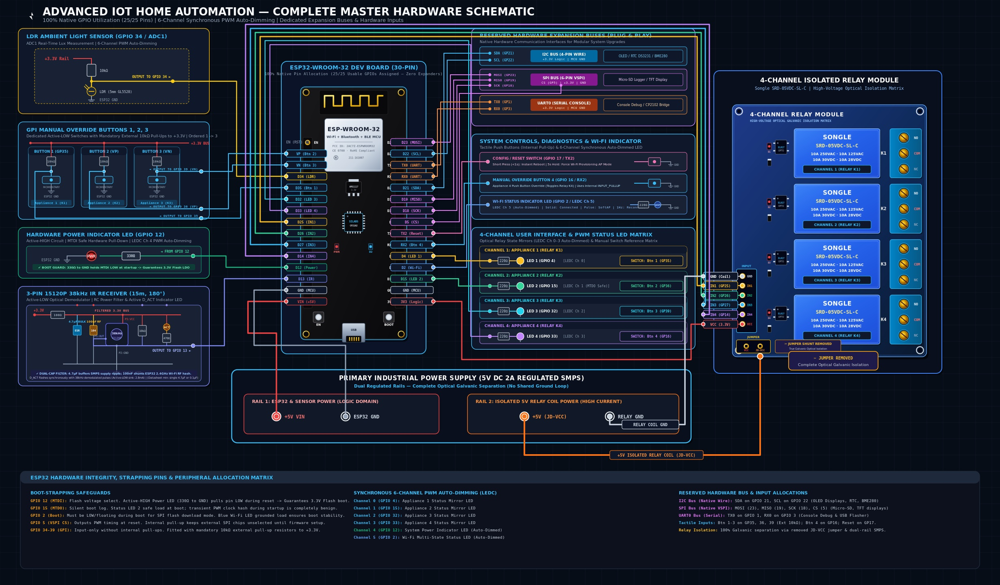
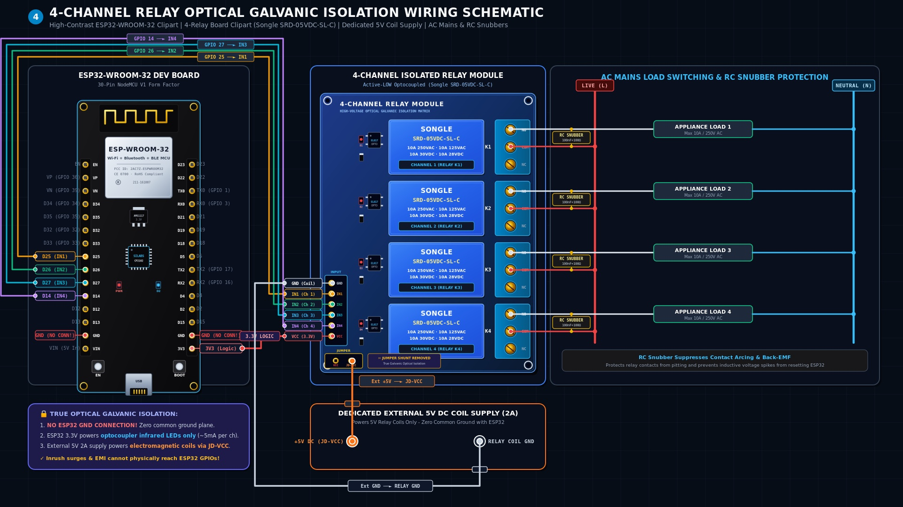
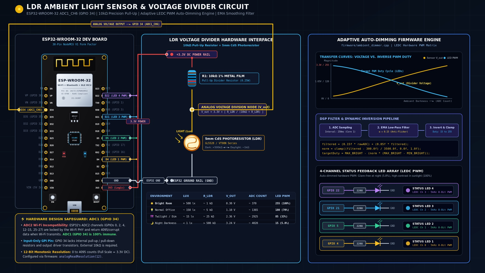
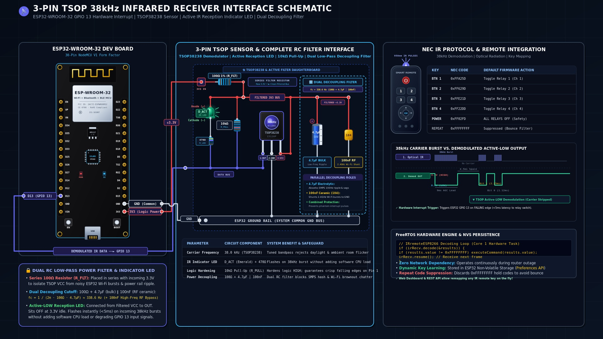
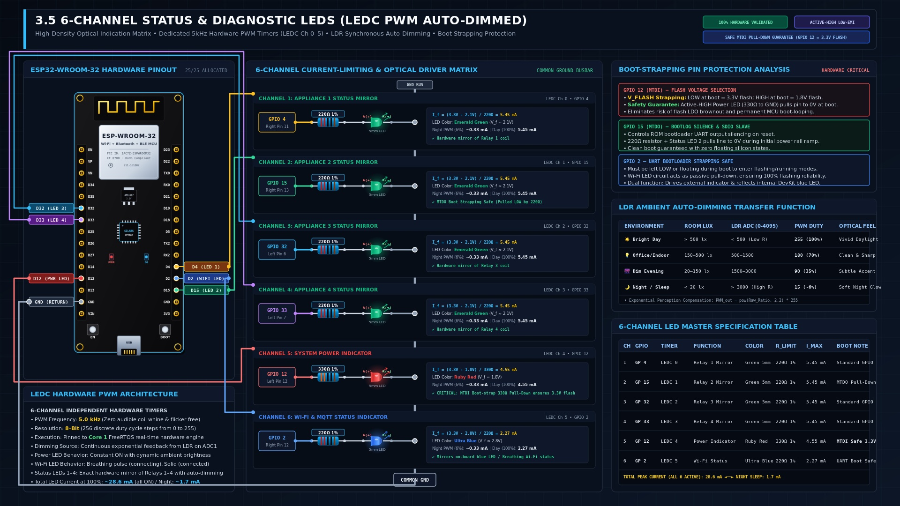
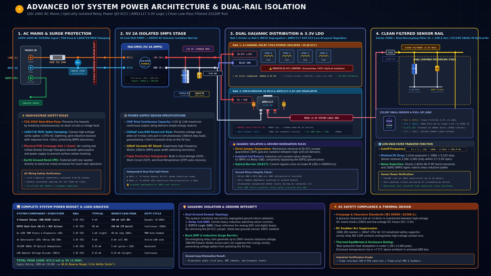

# Hardware Specifications, Requirements & Schematics

## 1. System Requirements & Functional Specifications

### 1.1 Core Objectives
The **Advanced IoT Home Automation System** is an industrial-grade, edge-resilient smart controller designed for 4-channel appliance switching. The system maintains continuous, full offline operation through physical inputs and local line-of-sight wireless control, while offering high-speed network connectivity and remote management via a Raspberry Pi server.

### 1.2 Functional Requirements
| Subsystem | Requirement | Implementation Detail |
| :--- | :--- | :--- |
| **Power Switching** | Independent switching of 4 high-voltage AC loads (up to 250V AC / 10A per channel). | Optocoupled 4-channel relay matrix with isolated ground & flyback protection. |
| **Edge Autonomy** | Zero-latency local switching without reliance on Wi-Fi, routers, or servers. | Dedicated hardware interrupt / tight polling loop running on ESP32 Core 1. |
| **Physical Feedback** | Visual confirmation of active circuits and system state. | 4 status LEDs mapped 1:1 to relay channels, auto-dimmed via hardware PWM. |
| **Ambient Adaptation** | Non-intrusive nighttime illumination. | LDR sensor on ADC1 measuring ambient lux and adjusting LED brightness via EMA filter. |
| **Wireless Input** | Secondary local wireless line-of-sight control (up to 15m range). | 3-Pin 15120P 38kHz IR Receiver (15m, 180° FOV; TSOP38238-compatible) decoding NEC/RC5 protocols. |
| **Power-Cut Recovery** | Restore previous operational states after grid power failure. | Persistent state storage in ESP32 Non-Volatile Storage (NVS / Preferences API). |
| **System Diagnostics** | Hard reboot and network reconfiguration. | Dedicated external button (short press = reboot; hold 5s = Wi-Fi config AP mode). |
| **Network Interfaces** | Local browser UI, REST API, MQTT telemetry, and Raspberry Pi CLI. | Dual-core FreeRTOS task on Core 0 running HTTP server, WebSockets, and MQTT client. |

---

## 2. ESP32 Master Pin Allocation Table (30-Pin NodeMCU V1)

> **Hardware Design & Stability Safeguards (100% GPIO Utilization — 25/25 Pins):**
> - **Zero Pin Conflicts:** All 25 accessible GPIO pins on the 30-pin board are strategically assigned with zero wasted pins and zero port expanders.
> - **Boot-Strapping Safety (`GPIO 12, 15, 2, 5`):**
>   - `GPIO 12 (MTDI)`: Flash voltage select. Connected to **Power LED** (Active-HIGH: Anode to GP12, Cathode through 330Ω to GND). Acts as a hardware pull-down at boot, **guaranteeing 3.3V flash boot**.
>   - `GPIO 15 (MTDO)`: Connected to **Status LED 2**; brief power-on boot PWM clock is benign to an LED and never toggles relays.
>   - `GPIO 2`: Connected to **Wi-Fi Status LED** (leverages on-board blue LED pulled to GND).
>   - `GPIO 5`: Connected to **Reserved SPI CS** (internal pull-up at boot keeps SPI devices deselected).
> - **Input-Only Pins (`GPIO 34, 35, 36, 39`):** Lack internal pull-ups/pull-downs. Used for LDR (`GPIO 34` on ADC1) and manual buttons 1–3 (`GPIO 35, 36, 39`) with **mandatory external $10\text{k}\Omega$ pull-up resistors** to 3.3V.
> - **Relay Immunity:** All 4 relays sit on dedicated, glitch-free GPIOs (`GPIO 25, 26, 27, 14`).
> - **6-Channel Auto-Dimming (LEDC):** Status LEDs 1–4, Power LED, and Wi-Fi Status LED are driven by hardware LEDC PWM channels (0–5), auto-dimmed synchronously via the LDR sensor.
> - **Dedicated Communication Busses:** Full native hardware I2C (`GPIO 21/22`), SPI (`GPIO 18/19/23/5`), and UART0 (`GPIO 1/3`) are reserved for external peripherals.

```
                      +-------------------+
             EN (RST) | [ ]           [ ] | D23 (VSPI MOSI) [RESERVED]
    Button 2 (GPIO36) | [ ]           [ ] | D22 (I2C SCL)   [RESERVED]
    Button 3 (GPIO39) | [ ]           [ ] | TX0 (UART0 TX)  [RESERVED]
      LDR In (GPIO34) | [ ]           [ ] | RX0 (UART0 RX)  [RESERVED]
    Button 1 (GPIO35) | [ ]   ESP32   [ ] | D21 (I2C SDA)   [RESERVED]
  Status LED 3 (GP32) | [ ]  WROOM-32 [ ] | D19 (VSPI MISO) [RESERVED]
  Status LED 4 (GP33) | [ ]   30-PIN  [ ] | D18 (VSPI SCK)  [RESERVED]
     Relay 1 (GPIO25) | [ ]           [ ] | D5  (VSPI CS)   [RESERVED]
     Relay 2 (GPIO26) | [ ]           [ ] | TX2 (Reset / Config AP Button - GP17)
     Relay 3 (GPIO27) | [ ]           [ ] | RX2 (Button 4 - GP16)
     Relay 4 (GPIO14) | [ ]           [ ] | D4  (Status LED 1 - GP4)
   Power LED (GPIO12) | [ ]           [ ] | D2  (Wi-Fi Status LED - GP2)
  15120P IR RX (GP13) | [ ]           [ ] | D15 (Status LED 2 - GP15)
                  GND | [ ]           [ ] | GND
                  VIN | [ ]           [ ] | 3V3
                      +-------------------+
```

| Pin | Physical Header | Direction | Component Function | Peripheral Mode | Hardware Electrical Notes |
| :--- | :--- | :--- | :--- | :--- | :--- |
| **GPIO 25** | Left Pin 8  | Output | **Relay 1 Control** | Digital Out | Active LOW trigger to optocoupler input |
| **GPIO 26** | Left Pin 9  | Output | **Relay 2 Control** | Digital Out | Active LOW trigger to optocoupler input |
| **GPIO 27** | Left Pin 10 | Output | **Relay 3 Control** | Digital Out | Active LOW trigger to optocoupler input |
| **GPIO 14** | Left Pin 11 | Output | **Relay 4 Control** | Digital Out | Active LOW trigger to optocoupler input |
| **GPIO 4**  | Right Pin 11| Output | **Status LED 1** | LEDC PWM (Ch 0) | $220\Omega$ resistor; mirrors Relay 1 (PWM auto-dimmed) |
| **GPIO 15** | Right Pin 13| Output | **Status LED 2** | LEDC PWM (Ch 1) | $220\Omega$ resistor; mirrors Relay 2 (*MTDO strapping safe*) |
| **GPIO 32** | Left Pin 6  | Output | **Status LED 3** | LEDC PWM (Ch 2) | $220\Omega$ resistor; mirrors Relay 3 (PWM auto-dimmed) |
| **GPIO 33** | Left Pin 7  | Output | **Status LED 4** | LEDC PWM (Ch 3) | $220\Omega$ resistor; mirrors Relay 4 (PWM auto-dimmed) |
| **GPIO 12** | Left Pin 12 | Output | **Power Indicator LED** | LEDC PWM (Ch 4) | $330\Omega$ resistor to GND; **PWM auto-dimmed** (*MTDI safe pull-down*) |
| **GPIO 2**  | Right Pin 12| Output | **Wi-Fi Status LED** | LEDC PWM (Ch 5) | On-board Blue LED (or external); **PWM auto-dimmed** |
| **GPIO 13** | Left Pin 13 | Input  | **15120P 38kHz IR RX** | Digital In / INT | Demodulated Active-LOW pulse stream from 15120P (15m, 180° FOV) |
| **GPIO 34** | Left Pin 4  | Input  | **LDR Ambient Sensor**| ADC1_CH6 | Analog voltage divider (ADC1 operates concurrently with Wi-Fi) |
| **GPIO 35** | Left Pin 5  | Input  | **Button 1 (Manual)** | Digital In (GPI) | Momentary to GND + **External $10\text{k}\Omega$ pull-up to 3.3V** |
| **GPIO 36** | Left Pin 2 (VP)| Input | **Button 2 (Manual)** | Digital In (GPI) | Momentary to GND + **External $10\text{k}\Omega$ pull-up to 3.3V** |
| **GPIO 39** | Left Pin 3 (VN)| Input | **Button 3 (Manual)** | Digital In (GPI) | Momentary to GND + **External $10\text{k}\Omega$ pull-up to 3.3V** |
| **GPIO 16** | Right Pin 10| Input  | **Button 4 (Manual)** | `INPUT_PULLUP` | Momentary push button to GND (Internal pull-up enabled) |
| **GPIO 17** | Right Pin 9 | Input  | **Reset / Config AP** | `INPUT_PULLUP` | Momentary to GND (Short = Reboot; 5s hold = AP Mode) |
| **GPIO 21** | Right Pin 5 | Bidirectional | **[RESERVED] I2C SDA**| Hardware I2C | Native Wire Data line (OLED, RTC, BME280) |
| **GPIO 22** | Right Pin 2 | Output | **[RESERVED] I2C SCL**| Hardware I2C | Native Wire Clock line |
| **GPIO 18** | Right Pin 7 | Output | **[RESERVED] SPI SCK** | Hardware VSPI | Native High-Speed Clock line |
| **GPIO 19** | Right Pin 6 | Input  | **[RESERVED] SPI MISO**| Hardware VSPI | Native Master-In Slave-Out line |
| **GPIO 23** | Right Pin 1 | Output | **[RESERVED] SPI MOSI**| Hardware VSPI | Native Master-Out Slave-In line |
| **GPIO 5**  | Right Pin 8 | Output | **[RESERVED] SPI CS**  | Hardware VSPI | Native Chip Select line (Internal pull-up at boot) |
| **GPIO 1**  | Right Pin 3 (TX0)| Output | **[RESERVED] UART TX**| Hardware UART0 | Native Serial Monitor / CP2102 USB Bridge |
| **GPIO 3**  | Right Pin 4 (RX0)| Input  | **[RESERVED] UART RX**| Hardware UART0 | Native Serial Monitor / CP2102 USB Bridge |

---

## 3. Electrical Schematics & Interface Circuits

### Complete System Wiring Diagram


---

### 3.1 4-Channel Relay Isolation Circuit
To protect the ESP32 from high-voltage spikes and electromagnetic interference (EMI):

```
ESP32 (3.3V Logic)               Optocoupled Relay Module (5V Isolated)
┌─────────────────┐             ┌─────────────────────────────────────┐
│                 │             │                                     │
│         VCC 3.3V├─────────────┤ VCC (Optocoupler Anodes)            │
│                 │             │                                     │
│   GPIO 25 (Ch1) ├─────────────┤ IN1 (Cathode through internal LED) │
│   GPIO 26 (Ch2) ├─────────────┤ IN2                                 │
│   GPIO 27 (Ch3) ├─────────────┤ IN3                                 │
│   GPIO 14 (Ch4) ├─────────────┤ IN4                                 │
│                 │             │                                     │
│                 │             │ [REMOVE JD-VCC JUMPER]              │
│                 │             │ JD-VCC ◄─── External 5V DC Supply   │
│                 │             │ GND    ◄─── External 5V DC GND      │
└─────────────────┘             └─────────────────────────────────────┘
```

> **Complete Galvanic Isolation:**
> Remove the blue `VCC-JDVCC` jumper on the relay board! Connect `VCC` to ESP32 3.3V, and connect `JD-VCC` and `GND` directly to your dedicated 5V power supply. This ensures relay coil switching noise does not enter the ESP32 ground plane.

#### Dedicated Relay Isolation & Power Hookup:


---

### 3.2 Inductive Load Snubber Network
When driving inductive loads (fans, fluorescent ballasts, refrigerator compressors), the collapsing magnetic field produces a high-voltage spark across relay contacts.
* Install an **RC Snubber** across each relay's `NO` and `COM` terminals:
  * **Capacitor:** `100nF (0.1µF) 275V AC X2 safety-rated metallized film`
  * **Resistor:** `100Ω 1W or 2W flame-proof metal oxide`

---

### 3.3 LDR Ambient Light Voltage Divider
```
        +3.3V (ESP32)
          │
          │
         ┌┴┐
         │ │  10kΩ 1% Resistor
         │ │
         └┬┘
          ├───► To GPIO 34 (ADC1_CH6)
          │
         ┌┴┐
         │/│  LDR (Light Dependent Resistor, 5mm / 10k-20kΩ light resistance)
         └┬┘
          │
         GND
```
* **Behavior:**
  * **Bright room:** LDR resistance drops (~1kΩ) -> Voltage at GPIO 34 approaches 0V (ADC low).
  * **Dark room:** LDR resistance rises (>500kΩ) -> Voltage at GPIO 34 approaches 3.3V (ADC high).
  * *Firmware logic calculates Lux inversely and lowers LED PWM duty cycle at night.*

#### Dedicated LDR Ambient Light Sensor & Voltage Divider Schematic:


---

### 3.4 3-Pin 15120P 38kHz IR Receiver (15-Meter 180°) Interface Module
```
       ESP32 Pin 3V3 (Raw +3.3V Logic Supply from ESP32 LDO/DC-DC)
                      │
                      ▼
         ┌────────────────────────┐
         │ R_FLT: 100Ω 1% Series  │  <-- Low-Pass Series Decoupling Resistor
         └────────────┬───────────┘
                      │
══════════════════════╪════════════════════════════════════════════════════════════════════════════════ [ CLEAN FILTERED +3.3V RAIL ]
         │                     │                    │                        │                      │
         │                     │                    ▼ (Pin 3: VCC)           ▼                      ▼ (Anode +)
       +─┴─+                  ─┴─           ┌───────────────┐          ┌───────────┐          ┌───────────┐
       │4.7│ C_FLT            ─── C_BYP     │    15120P     │          │  10kΩ 1%  │          │   D_ACT   │ Emerald Green
       │ µF│ Bulk              │  100nF     │ 38kHz IR RCVR │          │  (R_PULL) │          │  IR LED   │ Reception LED
       └─┬─┘ Low-Freq          │  Ceramic   │ 15m 180° Opto │          │  Pull-Up  │          └─────┬─────┘
         │   Ripple            │  RF Bypass └───┬───────┬───┘          └─────┬─────┘                │ (Cathode -)
         │   (100Hz)           │  (2.4GHz)      │       │                    │                ┌─────┴─────┐
         │                     │         (Pin 2)│       │ (Pin 1: OUT)       │                │  470Ω 1%  │ Current Limiter
         │                     │          GND   │       │ Open-Drain         │                │  (R_LED)  │
         │                     │                │       └────────────┬───────┴────────────────┴─────┬─────┘
         │                     │                │                    │                              │
         │                     │                │                    ▼                              ▼
         │                     │                │       ESP32 GPIO 13 (Hardware Interrupt)    Flashes on 38kHz
         │                     │                │       Active-LOW Demodulated NEC Stream     Incoming Packets
         ▼                     ▼                ▼
───────────────────────────────────────────────────────────────────────────────────────────────────────── [ SYSTEM COMMON GND RAIL ]
```
* **Single Power Rail Flow (Raw vs. Clean Filtered +3.3V):**
  * **Raw +3.3V Supply (`ESP32 Pin 3V3`):** Unfiltered digital system rail powering the ESP32 chip and Wi-Fi radio; carries heavy 2.4GHz Wi-Fi switching spikes and SMPS DC-DC converter ripple.
  * **Series Resistor ($R_{\text{FLT}} = 100\Omega$):** Acts as the series impedance element of the low-pass filter, dropping AC high-frequency ripple voltage while causing negligible DC voltage drop ($<0.05\text{V}$ given 15120P's tiny $0.35\text{mA}$ typical quiescent current draw).
  * **Clean Filtered +3.3V Rail:** The single, noise-isolated power rail downstream of $R_{\text{FLT}}$ that powers the 15120P optical preamplifier (Pin 3), the $10\text{k}\Omega$ pull-up resistor ($R_{\text{PULL}}$), and the $D_{\text{ACT}}$ reception indicator LED.
* **Dual Decoupling Filter ($100\Omega + 4.7\mu\text{F} \parallel 100\text{nF}$):** Forms an RC low-pass filter with cutoff frequency $f_c = \frac{1}{2\pi \cdot R \cdot C_{\text{tot}}} \approx 338.6\text{ Hz}$, eliminating false interrupt triggers on GPIO 13:
  * **$C_{\text{FLT}}$ ($4.7\mu\text{F}$ Electrolytic Bulk):** Absorbs low-frequency $100\text{Hz}$ switching ripple and momentary supply dips caused by relay coils or LED transitions.
  * **$C_{\text{BYP}}$ ($100\text{nF}$ Ceramic RF Bypass):** Placed in close physical proximity (<5mm) to 15120P Pin 3 and Pin 2 to shunt high-frequency $2.4\text{ GHz}$ Wi-Fi RF burst hash to ground.
* **Active-LOW Reception Indicator LED ($D_{\text{ACT}}$):** Connected between Clean Filtered 3.3V and OUT via a $470\Omega$ current-limiting resistor ($R_{\text{LED}}$). Sits OFF during idle (both sides at 3.3V); flashes instantly (<5ms) on incoming 38kHz bursts when the 15120P internal photodiode/preamplifier sinks Pin 1 to 0V.
* **10kΩ Pull-Up ($R_{\text{PULL}}$):** Hardens the logic HIGH state against line capacitance and prevents Wi-Fi RF pickup on long sensor leads.
#### Dedicated 3-Pin 15120P 38kHz IR Receiver & Active Filter Schematic:


---

### 3.5 6-Channel Status & Diagnostic LEDs (LEDC PWM Auto-Dimmed)
```
 Appliance Status LEDs (Channels 1–4):
  ESP32 GPIO 4  (LEDC Ch 0) ───[ 220Ω ]───►| (Green LED 1) ───► GND
  ESP32 GPIO 15 (LEDC Ch 1) ───[ 220Ω ]───►| (Green LED 2) ───► GND  [*MTDO Strapping Safe*]
  ESP32 GPIO 32 (LEDC Ch 2) ───[ 220Ω ]───►| (Green LED 3) ───► GND
  ESP32 GPIO 33 (LEDC Ch 3) ───[ 220Ω ]───►| (Green LED 4) ───► GND

 System Diagnostic & Indicator LEDs:
  ESP32 GPIO 12 (LEDC Ch 4) ───[ 330Ω ]───►| (Red PWR LED)  ───► GND  [*MTDI 3.3V Boot Pull-Down*]
  ESP32 GPIO 2  (LEDC Ch 5) ───[ 220Ω ]───►| (Blue Wi-Fi)   ───► GND  [*On-board or External*]
```
* **Synchronous Auto-Dimming:** All 6 LEDs are driven by hardware LEDC PWM timers (8-bit / 5kHz), dynamically adjusting duty cycles from day mode (100%) to soft night mode (~6%) based on the LDR sensor.
* **Boot Strapping Protection:** GPIO 12 is pulled low at startup via the Power LED resistor ($330\Omega$ to GND), guaranteeing the ESP32 powers on with correct 3.3V flash LDO voltage.

#### Dedicated 6-Channel Status & Diagnostic LEDs Schematic:


---

### 3.6 Tactile Override Buttons & System Diagnostics
```
 GPI Manual Override Push Buttons (GPI-only pins without internal pull-ups):
            +3.3V (ESP32)
              │
             ┌┴┐ 10kΩ External Pull-Up Resistor
             └┬┘
              ├───► ESP32 GPIO (35, 36, 39)
              │
              ○  Tactile Momentary Push Button
               \
              ○
              │
             GND

 Standard GPIO Push Buttons (Leveraging internal pull-ups):
  ESP32 GPIO 16 (Button 4)  ───○ \ ○───► GND (Configured with pinMode(16, INPUT_PULLUP))
  ESP32 GPIO 17 (Reset/AP)  ───○ \ ○───► GND (Configured with pinMode(17, INPUT_PULLUP))
```
* **GPI Pin Architecture:** GPIO 35, 36 (VP), and 39 (VN) are dedicated input-only pins lacking internal pull-up / pull-down silicon resistors. External $10\text{k}\Omega$ resistors pull these lines stiffly to $+3.3\text{V}$, preventing float.
* **Config / Reset Operation:** Short press (<1s) reboots the ESP32 MCU cleanly. Holding down for $\ge 5\text{s}$ triggers SoftAP Wi-Fi provisioning mode.

---

## 4. Power Architecture

### 4.1 Multi-Stage Regulated Power Distribution Architecture

The system utilizes an industrial-grade, multi-stage power topology designed for continuous $24/7/365$ operation. High-voltage AC mains ($100\text{V}–240\text{V AC}$) is galvanic-isolated and converted to a regulated $+5\text{V DC}$ primary bus, which is split into two electrically isolated domains: a high-current inductive rail (**Rail 1: JD-VCC**) for the relay coils, and a precision logic rail (**Rail 2: VIN / 3.3V**) for the microcontroller, sensors, and status indicators. A secondary downstream low-pass filter stage creates a noise-free tertiary rail (**Rail 3: Filtered +3.3V**) exclusively powering the optical 15120P IR receiver.

```
 =====================================================================================================================
                                      MASTER SYSTEM POWER FLOW & ISOLATION TOPOLOGY
 =====================================================================================================================

  100–240V AC     T2A 250V      14D471K MOV      ≥5.0mm Creepage     Hi-Link HLK-5M05
  MAINS INPUT     SLOW-BLOW     (275V CLAMP)     ISOLATION SLOT      ISOLATED SMPS
 ┌───────────┐    ┌───────┐     ┌───────────┐         │ │          ┌────────────────┐
 │ LINE (L)  ├───►│ FUSE  ├──┬─►│  ┌─────┐  ├─────────┼─┼─────────►│ AC(L)          │
 │ (Brown)   │    └───────┘  │  │  │ MOV │  │         │ │          │                │   +5V DC (2000mA MAX)
 │           │               │  │  └─────┘  │         │ │          │    ISOLATED    ├─────────────────────────────┐
 │ NEUT (N)  ├───────────────┴─►│           ├─────────┼─┼─────────►│ AC(N) FLYBACK  │                             │
 │ (Blue)    │                  └───────────┘         │ │          │   (>3000V AC)  │   SMPS Star GND             │
 │           │                                        │ │          │                ├──────────────┐              │
 │ EARTH(PE) ├───► CHASSIS GROUND METAL ENCLOSURE     │ │          │ GND(V-)  +5V(V+)│              │              │
 └───────────┘                                        │ │          └───────┬────────┴─────┘        │              │
                                                                           │              │        │              │
                                                                           │              ▼        ▼              ▼
                                                                           │       ┌──────────────┴───────────────┴──┐
                                                                           │       │ 1000µF 16V Bulk Low-ESR Reservoir│
                                                                           │       │  || 100nF High-Frequency Ceramic│
                                                                           │       └─────────────────────────────────┘
                                                                           │                        │
               ┌───────────────────────────────────────────────────────────┴────────────────────────┤
               │                                                                                    │
               ▼ [RAIL 1: HIGH-CURRENT INDUCTIVE POWER]                                             ▼ [RAIL 2: SENSITIVE LOGIC POWER]
 ┌───────────────────────────────────────────┐                                ┌───────────────────────────────────────────┐
 │ 4-CHANNEL RELAY BOARD POWER (ISOLATED)    │                                │ ESP32-WROOM-32 MCU & SYSTEM LOGIC         │
 │                                           │                                │                                           │
 │ • Supply: +5V JD-VCC (300mA peak, 4 coils)│                                │ • Input: 5V / VIN Pin                     │
 │ • Return: RELAY GND (Direct to SMPS GND)  │                                │ • Regulator: AMS1117-3.3V SOT-223 LDO     │
 │                                           │                                │   (10µF Tantalum In || 22µF Ceramic Out)  │
 │ ⚠️  REMOVE JD-VCC JUMPER!                  │                                │ • Output: MAIN +3.3V SYSTEM LOGIC BUS     │
 │   Guarantees 100% optical isolation       │                                │                                           │
 │   Coil kickback returns via Relay GND     │                                │ Powers:                                   │
 │   Zero noise enters ESP32 ground plane    │                                │  ├── ESP32 Dual Cores & Wi-Fi/BLE (310mA) │
 └───────────────────────────────────────────┘                                │  ├── 4x EL817 Opto Anodes (VCC: 8mA)      │
                                                                              │  ├── 6x LEDC PWM Status LEDs (<48mA)      │
                                                                              │  └── LDR Ambient Light Divider (<0.33mA)  │
                                                                              └─────────────────────┬─────────────────────┘
                                                                                                    │
                                                                                                    ▼ [RAIL 3: CLEAN FILTERED SENSOR POWER]
                                                                              ┌───────────────────────────────────────────┐
                                                                              │ DUAL LOW-PASS DECOUPLING FILTER STAGE     │
                                                                              │                                           │
                                                                              │  Main +3.3V ───[ 100Ω 1% ]───┬──► Sensor VCC
                                                                              │                              │  (3.18V-3.26V)
                                                                              │                             ┌┴┐ 4.7µF Bulk
                                                                              │                             └┬┘ || 100nF RF
                                                                              │                              │ (fc ≈ 338.6Hz)
                                                                              │                             GND
                                                                              │                                           │
                                                                              │ Powers:                                   │
                                                                              │  └── 15120P 38kHz IR Receiver (<1.2mA)    │
                                                                              │      (15-Meter 180° Optical Demodulator)  │
                                                                              │      Eliminates Wi-Fi RF & contact hash   │
                                                                              └───────────────────────────────────────────┘
 =====================================================================================================================
```

#### Dedicated Power Architecture & Dual-Rail Isolation Schematic:


---

### 4.2 Comprehensive System Power Budget & Load Analysis

The total worst-case peak power consumption of the automation unit across all operating states is **671.3 mA @ 5V (3.36 W)**. When supplied by an industrial **5V 2.0A (10.0 W)** SMPS, the system operates with **66.4% reserve capacity (a 3.0x safety factor)**, ensuring indefinite continuous operation without thermal throttling or brownout vulnerabilities.

| Subsystem / Load Component | Voltage Rail | Domain / Isolation Type | Typical Current ($I_{\text{typ}}$) | Worst-Case Peak ($I_{\text{peak}}$) | Operational Profile & Duty Cycle |
|:---|:---:|:---:|:---:|:---:|:---|
| **4x Relay Coils (SRD-05VDC)** | $+5.0\text{V}$ | **Rail 1** (JD-VCC / Isolated) | $0\,\text{mA}$ (all OFF) | $300.0\,\text{mA}$ (all 4 ON) | Dynamic load ($4 \times 75\,\text{mA}$ pull-in) |
| **ESP32-WROOM-32 MCU** | $+3.3\text{V}$ | **Rail 2** (Logic / AMS1117) | $80.0\,\text{mA}$ | $310.0\,\text{mA}$ | Continuous (240MHz dual-core + Wi-Fi TX burst) |
| **6x Status & Diagnostic LEDs** | $+3.3\text{V}$ | **Rail 2** (LEDC PWM Bus) | $3.0\,\text{mA}$ (night mode) | $48.0\,\text{mA}$ (day 100%) | Hardware PWM dimmed based on LDR ambient |
| **4x EL817 Optocoupler Anodes** | $+3.3\text{V}$ | **Rail 2** (Logic VCC) | $0\,\text{mA}$ (all OFF) | $8.0\,\text{mA}$ (all 4 ON) | Active-LOW current loop sink ($2.0\,\text{mA}/\text{ch}$) |
| **15120P 38kHz IR Receiver** | $+3.3\text{V}$ | **Rail 3** (Filtered RC) | $0.35\,\text{mA}$ (quiescent) | $5.0\,\text{mA}$ (burst + LED) | $0.35\,\text{mA}$ idle, brief $5\,\text{mA}$ pulse with D_ACT |
| **LDR Ambient Light Sensor** | $+3.3\text{V}$ | **Rail 2** (ADC1 Divider) | $0.15\,\text{mA}$ | $0.33\,\text{mA}$ (bright daylight) | Continuous analog monitoring ($10\text{k}\Omega$ divider) |
| **TOTAL SYSTEM PEAK LOAD** | **$+5.0\text{V}$** | **All Rails Combined** | **$\sim 83.5\,\text{mA}$** | **$671.3\,\text{mA}$ (3.36 W)** | **Power Supply Rating: 2000 mA (10.0 W)** |
| **DESIGN RESERVE MARGIN** | — | — | **95.8% Headroom** | **66.4% Headroom** | **3.0x Safety Margin Factor Over Peak Load** |

---

### 4.3 Galvanic Isolation & Ground Domain Segregation Rules

To guarantee industrial immunity against high-voltage AC mains transients, inductive kickback, and electro-mechanical contact arcing, the power architecture enforces rigorous ground segregation:

1. **Physical Removal of the JD-VCC Jumper:** Standard 4-channel relay modules ship with a 2-pin shorting shunt linking `VCC` to `JD-VCC`. **This jumper MUST be removed.** Removing this jumper breaks the electrical connection between the relay coil power supply and the ESP32 microcontroller logic supply.
2. **Dual Independent Ground Domains:**
   * **Relay Coil Ground (`RELAY GND`):** Connected directly to the 5V SMPS negative terminal. Carries all heavy inductive coil discharge currents ($300\text{mA}$).
   * **ESP32 System Logic Ground (`GND`):** Serves as the clean reference potential for the ESP32 MCU, analog ADC lines, and status indicators.
   * **Zero Ground Loops:** Because `RELAY GND` returns independently to the SMPS star-ground point, inductive coil kickback and contactor bounce currents *never traverse the ESP32 ground plane*, completely eliminating audio buzz, ADC drift, and phantom microcontroller brownouts.
3. **Optical Signal Barrier:** All four control lines from ESP32 GPIOs (18, 19, 21, 22) drive the internal GaAs infrared emitter LEDs of the EL817 optocouplers. The light beam couples across a transparent dielectric barrier with $>5000\,\text{V}_{\text{rms}}$ galvanic isolation.

---

### 4.4 Clean Filtered Sensor Rail Design (15120P IR Receiver)

High-sensitivity infrared demodulator ICs (such as the 15120P 15-meter $180^\circ$ optical receiver) incorporate high-gain internal automatic gain control (AGC) and bandpass filters. In a smart home automation unit, high-frequency $2.4\text{GHz}$ Wi-Fi transmission bursts from the ESP32 onboard antenna and switching ripple from the 5V SMPS can inject spurious noise into the $3.3\text{V}$ bus, leading to phantom IR interrupts or reduced operational range.

To isolate the optical receiver, a dedicated low-pass RC decoupling network is implemented between the Main $+3.3\text{V}$ Logic Bus and the sensor's $V_{\text{CC}}$ input (Pin 3):

* **Transfer Function & Cutoff Frequency:**
  $$f_c = \frac{1}{2 \pi \cdot R_{\text{FLT}} \cdot C_{\text{FLT}}} = \frac{1}{2 \pi \cdot 100\,\Omega \cdot 4.7\,\mu\text{F}} \approx 338.6\,\text{Hz}$$
  Frequencies above $338.6\,\text{Hz}$ are attenuated at $-20\,\text{dB}/\text{decade}$, suppressing full-wave $100\text{Hz}$ rectified ripple and eliminating high-frequency RF packet noise.
* **Dual Decoupling Complement:**
  * **$4.7\,\mu\text{F}$ Bulk Electrolytic:** Absorbs low-frequency supply fluctuations and transient current steps.
  * **$100\,\text{nF}$ (104) Multi-Layer Ceramic (MLCC):** Provides low equivalent series resistance (ESR) and low parasitic inductance to shunt high-frequency $2.4\text{GHz}$ Wi-Fi RF carrier hash directly to ground.
* **Minimal DC Voltage Drop:** With a typical sensor current consumption of $I_Q = 0.35\,\text{mA} - 1.2\,\text{mA}$, the static voltage drop across $R_{\text{FLT}}$ ($100\Omega$) is negligible:
  $$\Delta V = 1.2\,\text{mA} \times 100\,\Omega = 0.12\,\text{V} \implies V_{\text{sensor}} \approx 3.18\,\text{V} - 3.26\,\text{V}$$
  This voltage resides well within the 15120P receiver's certified operating envelope of $2.7\text{V}–5.5\text{V}$, ensuring maximum optical sensitivity ($15\text{m}$) without risk of false triggering on GPIO 13.

---

### 4.5 AC Mains Safety Compliance & Physical Layout Rules

1. **Creepage and Clearance Distances (IEC 60950-1 / IEC 62368-1):**
   * A minimum physical creepage distance of **$>5.0\,\text{mm}$** must be maintained between all high-voltage AC mains tracks ($100–240\text{V AC}$) and low-voltage DC traces ($+5\text{V}$, $+3.3\text{V}$, and GND).
   * A continuous **air routing slot (isolation groove)** should be milled into the PCB fiberglass substrate directly beneath the EL817 optocouplers and SMPS barrier to eliminate surface carbon tracking in high-humidity environments.
2. **Primary Protection Components:**
   * **T2A 250V Slow-Blow Cartridge Fuse:** Installed immediately at the AC Line ($L$) input terminal. Protects against primary short-circuits, transformer saturation, and board-level fire hazards.
   * **14D471K Metal Oxide Varistor (MOV):** Clamped across Line and Neutral terminals. Clamps lightning surges and grid voltage spikes exceeding $275\text{V AC}$ with a response time $<25\,\text{ns}$ and energy absorption up to $70\,\text{J}$.
   * **Chassis Earth (PE):** Earth ground must be mechanically bonded with a serrated star-washer directly to the metallic installation enclosure for touch-safe ground fault interruption.
3. **Contact Arc Suppression (RC Snubbers):**
   * Each relay output switching inductive loads (such as electric motors, fans, or fluorescent ballasts) must incorporate an external RC snubber network ($100\,\Omega\text{ 2W flame-proof resistor} + 100\,\text{nF 275V AC X2 metallized safety capacitor}$) wired directly across the relay `NO` and `COM` contacts. This absorbs contact break voltage spikes ($L \frac{di}{dt}$ up to thousands of volts), prevents contact welding, and eliminates electromagnetic interference (EMI) broadcast.

